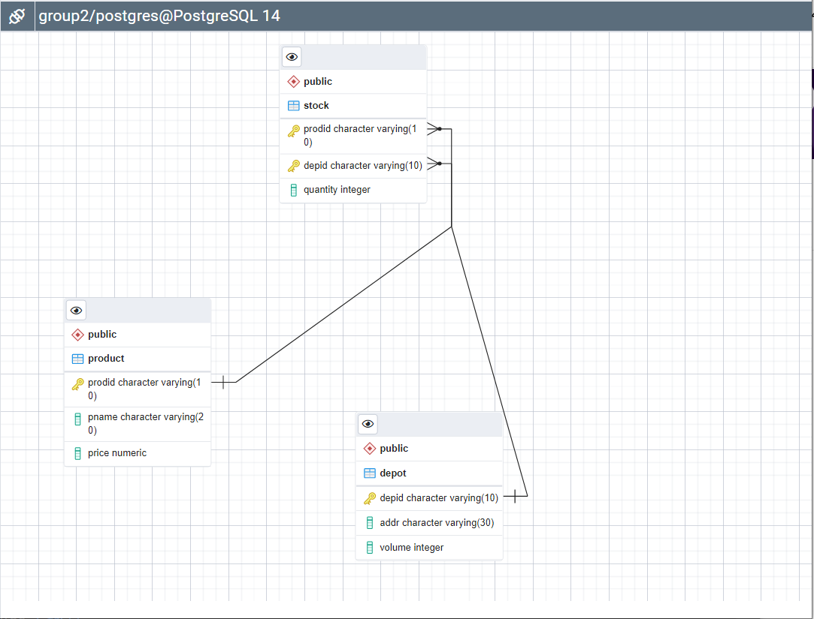

## DBMS PROJECT CS-623 GROUP2
Course name: CS623-DBMS-Fall2022 
Collaborators: <b>Sairam Kodimella</b> and <b>Gnanender Devera</b> 
Group- 2 
Operation:-<b>To Delete d1 from Depot and Stock</b>
  
## ERD DIAGRAM
</img>
  

<a href='https://www.google.com'>Video Link coming soon</a>

## Summary:
1. We first created the database schema and populated the tables with the given data the script is also added in the repo
2. We then loaded the jdbc module to the project structure and the .jar file used is also added to the Repo
3. We then started writing the java program but first establishing the database connection and displaying the pre-populated data and then we deleted the 'd1' depid from depot and then printed again the data inside the tables for verification processes.
4. As there is foreign_key constraint between Stock and Depot tables so we used 'ON DELETE CASCADE' during the schema.
5. So when ever we delete the rows of depot automatically the same will also be deleted in Stock table

#### Atomicity:- Atomicity is reinstated by setting setAutoCommit to false
#### Consistency:- We used ON DELETE CASCADE to delete respective rows in Stock table when we delete rows in Depot table. Which maintains the Consistency.
#### Isolation:-The command setTransactionIsolation(Connection.TRANSACTION_SERIALIZABLE) is used to maintain the Isolation
#### Durability:- As we are using the command commit() which means that the transaction is completed and committed to the database which will be persistant overall. This is how the durability is attained.
